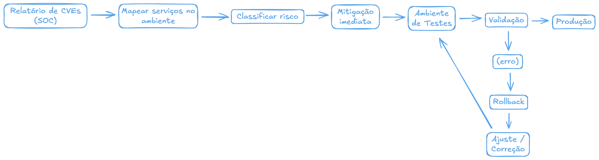
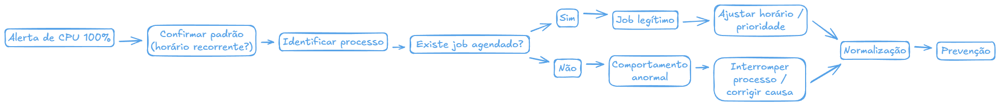

# Desafio LinuxOps e WindowsOps - Pleno

## Como responder este teste

1. O teste já começou quando você começou a ler este documento.

1. Você pode fazer um fork deste repositório em sua conta do Github e `comitar` as alterações lá. Ao mostrar que você sabe editar arquivos MD e trabalhar ideia com o Excalidraw isso contará pontos pra você. Se preferir pode criar um documento no Word/Powerpoint e encaminhar a sua resposta.

1. Responda neste mesmo documento ou em novo(s) arquivo(s). Como preferir.

1. Utilize o seu mecanismo de busca na Internet preferido para referências e construa as suas respostas. 

1. Cite suas fontes caso utilize blogs, sites, ou documentos como referências. Isso aumenta o peso da sua argumentação.

1. Se há vários caminhos para uma solução, apresente até duas alternativas.

1. Não peça para que outros respondam por você. Em algum momento você deverá demonstrar na prática que conhece realmente o que você disse que sabe.

1. Lembre-se deste teste. Na entrevista on-line discutiremos as suas respostas.

1. Se usar ChatGPT ou qualquer outro LLM para responder por você, saiba filtrar a resposta. No dia da entrevista repetiremos alguns testes ao vivo. Quem irá te entrevistar provavelmente treinou a LLM que você usou para consulta.

## Critério de avaliação

1. O tempo que você levou para responder o teste e quantas vezes renegociou o prazo de entrega diz muito sobre organização e comprometimento. Estamos avaliando o futuro candidato também neste aspécto.

1. Se a resposta foi gerada por IA ou se você não conseguir defender na entrevista com detalhes as suas respostas, talvez lhe daremos uma chance lá no futuro.

1. Queremos respostas objetivas e assertivas.

1. Respostas com diagramas exemplificando a estratégia e a forma de pensar serão mais bem avaliadas. Desbloqueie o modo projetista e arquiteto que existe em você.

1. Você pode criar scripts que resolvam os problemas pra você. Salve eles no repositório junto com as suas respstas.

1. Serão 10 perguntas, cada pergunta vale de 0 até 3 pontos. Os melhores avaliados seguem para uma entrevista on-line.

1. Nós entendemos que uma pessoa com pouca experiência estará sendo contratado para aprender com outras pessoas e precisa de supervisão constante (júnior). Pessoas com experiência e que podem desemplenhar funções com baixa supervisão são do nível pleno. Já pessoas com bastante experiência, que conseguem resolver problemas complexos sem apoio externo e sem supervisão já estão prontas para serem chamadas de sênior.


## WindowsOps

### Hardening

Liste 5 medidas de segurança (hardening) que você adotaria em um Windows Server em ambiente de produção.

#### Resposta

Em um ambiente de produção, eu penso em hardening como tudo aquilo que diminui a superfície de ataque do servidor e me dá mais controle sobre o que está acontecendo. Para um Windows Server, cinco medidas que considero essenciais são:

| Medida de Hardening | Descrição |
|--------------------|-----------|
| Aplicar políticas de segurança via GPO | Fortalecer políticas como senha forte, bloqueio por tentativas inválidas, expiração adequada e remoção de acessos desnecessários. Sempre que possível, seguir a *Microsoft Security Baseline*, que já traz um padrão seguro validado pela própria Microsoft. |
| Manter o sistema sempre atualizado | Utilizar Windows Update ou WSUS para garantir que os servidores estejam com os patches em dia. Atualizações fecham vulnerabilidades que muitas vezes já estão sendo exploradas ativamente. |
| Desativar serviços e portas não utilizados | Remover tudo que não é necessário, incluindo roles que não fazem sentido naquele servidor e portas abertas sem motivo. Exemplo: RDP liberado apenas para IPs confiáveis. Menos serviços ativos = menos pontos de ataque. |
| Restringir o acesso administrativo | Utilizar contas separadas para uso comum e administração, aplicando o princípio do menor privilégio. Para acessos remotos, sempre que possível, habilitar MFA para reduzir riscos em caso de comprometimento de credenciais. |
| Habilitar auditoria e monitoramento | Ativar logs de segurança para logins, falhas e alterações importantes, enviando esses eventos para um servidor central ou SIEM. Isso permite detectar comportamentos suspeitos e agir rapidamente em um possível incidente. |

Com essas cinco práticas, o servidor já sai de um estado “padrão” para um nível bem mais seguro, mostrando cuidado e maturidade em um ambiente corporativo.

### Backup de Active Directory

Você é responsável por vários Domain Controllers. Descreva sua estratégia de backup e os componentes críticos que devem ser incluídos no processo de backup diário do ambiente. Como você testaria a recuperação?

#### Resposta

Em um ambiente com vários Domain Controllers, eu trato o backup do Active Directory como algo crítico. O objetivo é garantir que sempre exista uma cópia íntegra e recente do AD, pronta para ser usada em caso de falha, erro humano ou ataque.

Para mim, backup só é confiável quando é testado. Por isso, periodicamente restauro esses dados em um ambiente isolado, simulando perda de um DC ou corrupção do AD. Assim eu valido se o controlador sobe corretamente, se o AD funciona, se as GPOs estão íntegras e se a replicação volta ao normal.

| Etapa | Estratégia / Processo |
|------|------------------------|
| System State dos DCs | Backup diário do System State, incluindo banco do AD, SYSVOL, registro e arquivos críticos. |
| Backup completo | Em DCs estratégicos, manter também backup completo do servidor para cenários de desastre total. |
| Armazenamento isolado | Guardar cópias fora do domínio e do próprio servidor, protegendo contra ransomware e corrupção em massa. |
| Redundância | Garantir que mais de um Domain Controller esteja coberto, evitando ponto único de falha. |
| Testes de recuperação | Restaurar periodicamente em ambiente isolado, simulando falhas reais e validando AD, GPOs e replicação. |

<br>

<p align="center">
  
</p>


### Monitoramento de filesystem

Você é responsável por monitorar o espaço em disco de 798 servidores Windows Server 2012 R2 a 2025. Isso gera diariamente 400 alertas de espaço em disco a 90% de uso. Em muitos desses alertas, depois de 10 minutos o espaço em disco já está 100% fazendo com que serviços parem de funcionar. Sugira uma estratégia (que você já tenha usado) para ser colocada em prática para evitar que alertas voltem a acontecer tão frequentemente.

#### Resposta

Em um ambiente grande como esse, com centenas de servidores, alertas constantes de disco quase sempre mostram que o problema não é só técnico, mas também de processo. Na minha experiência em redes, o que realmente funcionou foi mudar a abordagem: sair do modo “apagar incêndio” e passar a trabalhar de forma preventiva.

O primeiro passo foi classificar os servidores por tipo (aplicação, banco, arquivos, AD, etc.) e entender o padrão de crescimento de cada um. A partir disso, ajustamos dois níveis de alerta:

- Alerta preventivo em torno de 75–80%

- Alerta crítico em 90%

Quando o alerta preventivo disparava, já existia um fluxo definido: identificar rapidamente o que estava consumindo espaço e agir antes que o volume chegasse ao limite. Isso evitava que o time só fosse acionado quando o problema já estava crítico.

Também implementei rotinas controladas de limpeza para itens que costumam crescer rápido, sempre alinhadas com as equipes responsáveis:

- Logs antigos de aplicações

- Arquivos temporários

- Dumps de erro

- Pastas de cache ou update esquecidas

Além disso, passamos a trabalhar com tendência de crescimento. Em vez de olhar apenas “quanto está cheio”, analisávamos “quanto cresce por dia”. Assim, era possível prever quando um disco iria estourar e agir com antecedência, seja expandindo o volume, seja corrigindo a origem do consumo.

Com essa estratégia, os alertas deixaram de ser ruído constante e passaram a ser realmente úteis. Na prática, isso reduziu drasticamente os casos de disco em 100% e transformou o monitoramento em algo preventivo, e não apenas reativo.

<br>

<p align="center">
  
</p>


### Análise de patches de segurança

O time de SOC encaminhou um relatório de vulnerabilidades:

| CVE ID | Descrição |
|--------|-----------|
| CVE-2023-23397 | Vulnerabilidade crítica no Microsoft Outlook que permite execução remota de código através de mensagens especialmente criadas, afetando ambientes Exchange Server. |
| CVE-2022-26925 | Falha de segurança no LSA (Local Security Authority) que permite elevação de privilégios através de RPC calls não autenticados em Domain Controllers. |
| CVE-2021-34527 (PrintNightmare) | Vulnerabilidade RCE no Windows Print Spooler permitindo execução de código arbitrário com privilégios de SYSTEM em servidores Windows. |
| CVE-2020-1472 (Zerologon) | Vulnerabilidade crítica no Netlogon que permite atacantes assumirem controle total de Domain Controllers através de falha criptográfica. |
| CVE-2019-0708 (BlueKeep) | Falha RCE nos Remote Desktop Services (RDS) permitindo execução remota de código sem autenticação em versões antigas do Windows Server. |
| CVE-2022-21907 | Vulnerabilidade crítica no IIS (HTTP Protocol Stack) permitindo execução remota de código através de pacotes HTTP especialmente criados. |
| CVE-2021-44228 (Log4Shell) | Vulnerabilidade crítica de RCE na biblioteca Log4j do Java, permitindo execução remota de código através de JNDI lookup em aplicações Java. |
| CVE-2019-1068 | Vulnerabilidade no Microsoft SQL Server permitindo execução remota de código através de queries SQL especialmente criadas, afetando funções de T-SQL. |

Responda:

1. Como você resolveria esses problemas de segurança? 
1. Você poderia simplesmente atualizar tudo? 
1. Qual dessas updates potencialmente quebraria a aplicação em execução no servidor?

#### Resposta

**Como eu resolveria esses problemas de segurança?**

- Identifico quais CVEs realmente se aplicam ao ambiente (quais serviços existem).
- Priorizo por risco: Domain Controllers e RCE sem autenticação primeiro.
- Aplico mitigações imediatas quando existirem (desativar serviços, restringir portas, workarounds).
- Patches entram em produção de forma controlada: primeiro em teste, depois em produção em janela.

**Você poderia simplesmente atualizar tudo?**
Não. Atualizar tudo de uma vez em produção pode causar indisponibilidade. Patches precisam ser priorizados, testados e aplicados em ondas.

**Quais updates podem quebrar aplicações em execução?**

* **CVE-2021-44228 (Log4Shell)** – atualização de bibliotecas Java pode quebrar aplicações legadas.
* **CVE-2023-23397 (Outlook/Exchange)** – pode afetar integrações e plugins de e-mail.
* **CVE-2022-21907 (IIS)** – pode impactar aplicações web legadas.
* **CVE-2019-1068 (SQL Server)** – pode afetar queries, procedures e sistemas dependentes.

Esses exigem teste prévio. Já patches de sistema como Zerologon, BlueKeep e LSA normalmente têm baixo impacto funcional e alta prioridade de aplicação.

<br>

<p align="center">
  
</p>


### Análise de alto consumo de CPU

Um servidor está apresentando 100% de uso de CPU às 05h00 da manhã. Descreva passo-a-passo como você investigaria e resolveria este problema.

#### Resposta

Quando vejo um servidor em 100% de CPU às 05h00, eu parto do princípio de que algo programado está rodando naquele horário. Meu passo-a-passo é:

| Etapa | Ação |
|------|------|
| Confirmar o comportamento | Verificar no monitoramento se o pico ocorre sempre no mesmo horário e se é pontual ou contínuo. |
| Identificar o processo | Acessar o servidor e usar Gerenciador de Tarefas / Performance Monitor para identificar o processo que consome CPU, anotando serviço, PID e usuário. |
| Correlacionar com rotinas | Checar o Agendador de Tarefas e validar se há backups, jobs de manutenção, scripts ou rotinas de aplicação rodando nesse horário. |
| Entender o impacto | Avaliar se o consumo afeta serviços críticos, usuários ou causa falhas em aplicações. |
| Agir conforme o cenário | Se for job legítimo: ajustar horário, reduzir prioridade ou dividir a carga. Se for anormal: interromper o processo, corrigir a causa raiz e escalar para o time responsável. |
| Prevenir recorrência | Criar alertas específicos, documentar a causa e ajustar o processo para evitar nova saturação de CPU. |

<br>

<p align="center">
  
</p>

Assim, eu saio do “apagar incêndio” e transformo o incidente em algo previsível e controlado.

### Conta de administrador local

Em um ambiente corporativo com centenas de computadores Windows ingressados em domínio, todos possuem uma conta de administrador local necessária para atividades de suporte e contingência.

Historicamente, essa conta utiliza a mesma senha em todas as máquinas, o que facilita o suporte, mas cria um risco significativo: se um equipamento for comprometido, o invasor pode reutilizar essa credencial para obter acesso administrativo a outros computadores da rede (movimento lateral).

O desafio é garantir que:

- Cada computador tenha uma senha de administrador local única e forte;
- Essa senha seja trocada automaticamente em intervalos definidos;
- O time de TI consiga recuperar a senha sob demanda, de forma auditável;
- O acesso à senha seja restrito por permissões, evitando exposição indevida;
- A solução funcione de forma centralizada, sem intervenção manual máquina a máquina.

Como você resolveria esse desafio?

#### Resposta

Esse cenário pede uma solução que resolva o problema de segurança sem atrapalhar a operação. Manter a mesma senha em todas as máquinas é prático, mas abre a porta para movimento lateral caso um único computador seja comprometido.

A forma que eu já vi funcionar bem em ambiente corporativo é centralizar o gerenciamento dessa conta local, fazendo com que:

* Cada máquina tenha uma senha única e forte para o administrador local
* Essa senha seja trocada automaticamente em intervalos definidos
* O time de TI consiga consultar a senha quando precisar
* Todo acesso fique registrado para auditoria
* Ninguém precise ir máquina por máquina

Na prática, eu resolveria isso com uma política central no domínio, aplicada via GPO, onde cada computador passa a gerar e manter sua própria senha de administrador local. Essa senha:

* É criada automaticamente pelo próprio computador
* É diferente em cada máquina
* É rotacionada em períodos definidos (ex: a cada 30 dias)
* Fica armazenada de forma segura no diretório central

Quando o time de suporte precisa acessar uma máquina em contingência, ele consulta essa senha diretamente no ambiente central, com permissões controladas. Ou seja:

* Nem todo mundo pode ver
* Só grupos específicos de TI têm acesso
* Toda consulta pode ser auditada

Com isso, eu mantenho:

* A praticidade operacional (o suporte continua tendo acesso)
* A segurança (não existe mais senha reutilizada)
* O controle (quem acessou, quando e por quê)

O resultado é simples: mesmo que uma máquina seja comprometida, aquela credencial não serve para mais nenhuma outra. O atacante fica “preso” naquele equipamento, e o risco de movimento lateral praticamente desaparece.


## LinuxOps

### Gerenciamento de disco LVM

Um volume lógico (LVM) em um servidor Linux está ficando sem espaço. O storage foi expandido no hypervisor/SAN. Quais são os passos para reconhecer o novo espaço no sistema operacional e aumentar o filesystem com segurança, considerando diferentes tipos de filesystem (ex.: ext4 e XFS)?

### Monitoramento Zabbix

Você precisa instalar o agente do Zabbix em 3 servidores Red Hat 6. A versão do zabbix precisa ser a 7.x.x. Como você faria a instalação? Responda com os passos para a instalação. Onde você preve dificuldade?

Agora você precisa instalar o mesmo agente em 5.976 outros servidores. Você não sabe com exatidão se são Red Hat ou Debian. Como você instalaria? Onde você preve dificuldade?

### Novo usuário no Linux

Um cliente pediu para conectar no servidor Linux chamado `magela.fqdn`. Ele gostaria de conectar no servidor via SSH com chave RSA. Monte um passo-a-passo de comandos para que o usuário com Windows XP possa conectar a esse servidor Linux sem precisar informar a senha. Se o usuário precisar executar comandos como root sem saber a senha de root, quais passos você adicionaria no processo? Precisa explicar algo para o usuário?

### Proxy reverso

Uma aplicação web roda em dois servidores backend (`app01:8080` e `app02:8080`) atrás de um NGINX configurado como proxy reverso e load balancer.

Após uma atualização da aplicação, os usuários começaram a relatar erros intermitentes 502 Bad Gateway e, em alguns casos, perda de sessão após o login.

No servidor NGINX, os logs de erro mostram mensagens como:

```
connect() failed (111: Connection refused) while connecting to upstream
```

E nos logs de acesso é possível observar que algumas requisições são atendidas normalmente e outras falham.

Considerando o cenário descrito, quais seriam as principais hipóteses para os erros 502 e perda de sessão em um NGINX atuando como proxy reverso, e quais verificações e ajustes você faria no NGINX e nos backends para diagnosticar e corrigir o problema?

Como você restabeleceria em 1 min. a operação normal do serviço?

### Postfix relay

Um servidor Linux utiliza Postfix como MTA para envio de e-mails de uma aplicação interna. Recentemente, os e-mails enviados para domínios externos (ex.: Gmail, Outlook) não estão sendo entregues, enquanto envios para domínios internos funcionam normalmente.

Nos logs (`/var/log/maillog` ou `/var/log/mail.log`) aparecem mensagens como:

```
status=deferred (connect to gmail-smtp-in.l.google.com[142.250.xxx.xxx]:25: Connection timed out)
status=bounced (host gmail-smtp-in.l.google.com said: 550-5.7.1 Message rejected due to spam or policy)
```

Diante desse cenário, quais seriam as principais causas para falha no envio de e-mails externos via Postfix e quais verificações você faria no sistema e na configuração do Postfix para diagnosticar e corrigir o problema?
